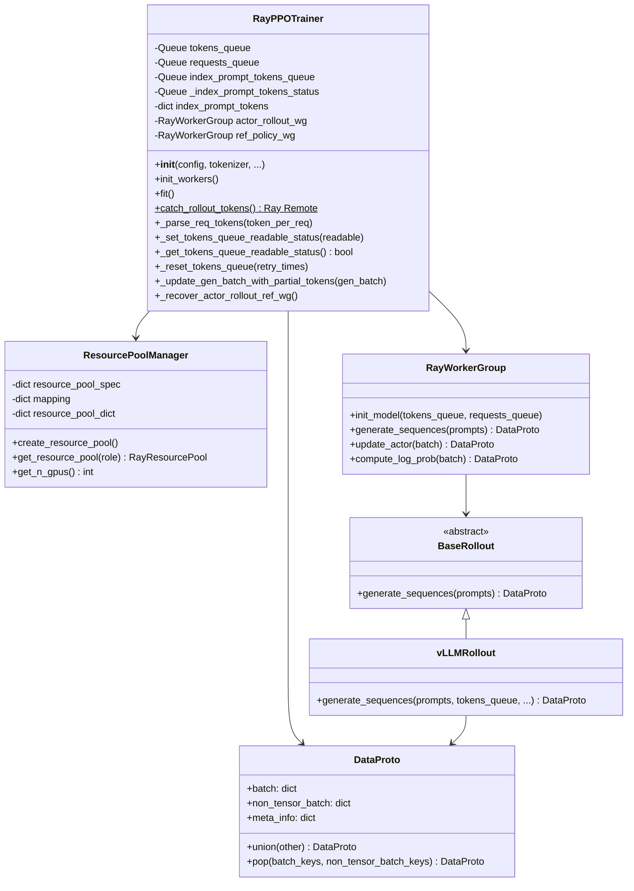
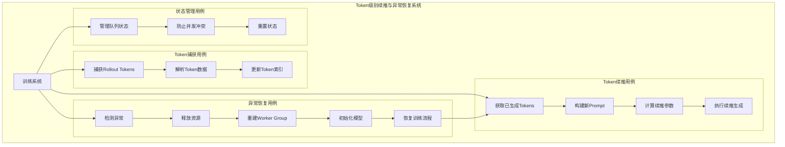
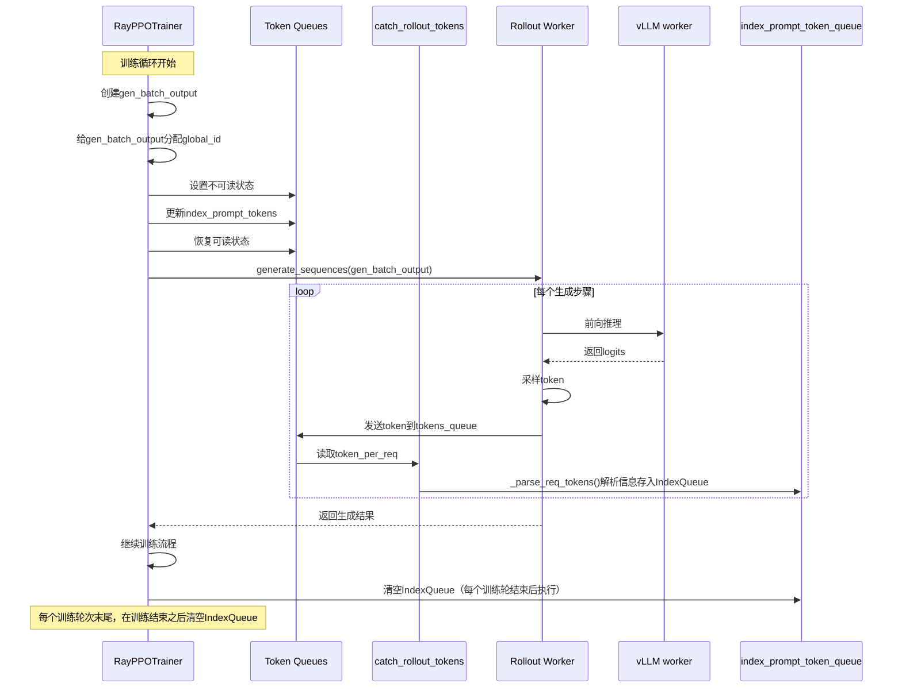
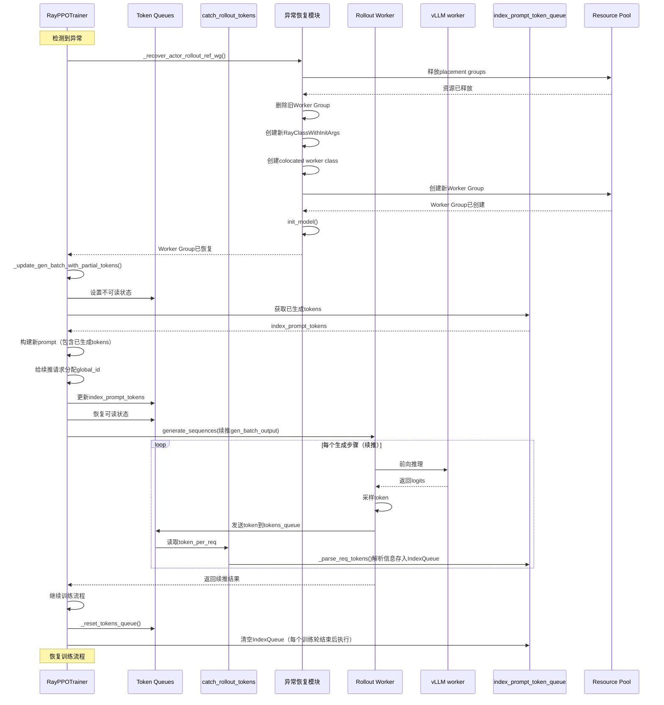
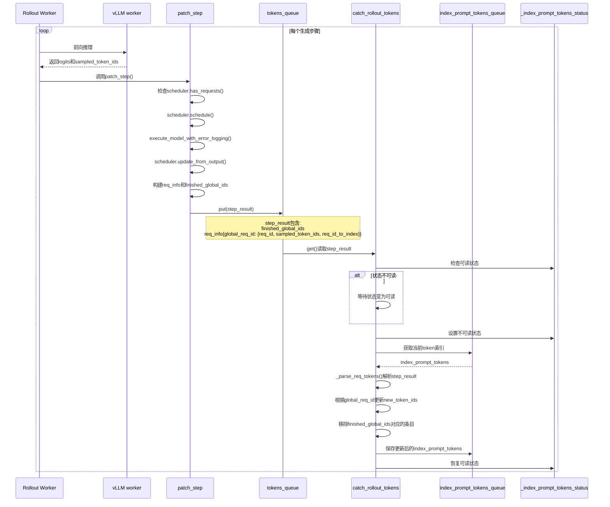

# Token级别续推与异常恢复功能详细设计文档

## 1. 特性概述

### 1.1 功能简介

本特性为VERL PPO训练器新增了**Token级别续推**和**异常恢复**两大核心能力，旨在提升大规模语言模型强化学习训练的稳定性和容错性。

**Token级别续推**：在rollout生成过程中，系统能够实时捕获每个请求生成的token，并在异常恢复后基于已生成的tokens继续生成，避免重复计算和资源浪费。

**异常恢复**：当Actor Rollout Worker Group发生异常（如OOM、进程崩溃等）时，系统能够自动重建Worker Group，并从断点处继续训练，保证训练任务的连续性。

### 1.2 核心价值

1. **提升训练稳定性**：通过异常恢复机制，避免因单次异常导致整个训练任务失败
2. **提高资源利用率**：Token级别续推避免重复生成已计算的部分，节省计算资源
3. **增强容错能力**：支持在分布式训练环境中自动处理节点故障和资源异常
4. **优化训练效率**：减少因异常恢复导致的训练时间损失

### 1.3 适用场景

- 大规模语言模型（LLM）的PPO训练
- 长时间运行的强化学习训练任务
- 资源受限或易发生OOM的训练环境
- 需要高可用性的生产训练场景

## 2. 特性需求概述

### 2.1 功能需求

#### 2.1.1 Token捕获需求

- **FR-1.1**：系统应能够实时捕获rollout生成过程中每个请求产生的token
- **FR-1.2**：系统应能够将捕获的token与对应的请求ID（global_id）关联
- **FR-1.3**：系统应支持多请求并发场景下的token捕获
- **FR-1.4**：系统应能够区分已完成和进行中的请求

#### 2.1.2 Token续推需求

- **FR-2.1**：系统应能够基于已生成的tokens继续生成后续tokens
- **FR-2.2**：系统应能够正确拼接原始prompt和已生成的tokens
- **FR-2.3**：系统应能够处理不同长度的prompt和已生成tokens的组合
- **FR-2.4**：系统应能够正确计算续推时的max_tokens参数

#### 2.1.3 异常恢复需求

- **FR-3.1**：系统应能够检测Actor Rollout Worker Group的异常
- **FR-3.2**：系统应能够释放异常Worker Group占用的资源
- **FR-3.3**：系统应能够重新创建Actor Rollout和Reference Policy Worker Group
- **FR-3.4**：系统应能够在恢复后继续执行训练流程

#### 2.1.4 状态管理需求

- **FR-4.1**：系统应能够管理token队列的读写状态
- **FR-4.2**：系统应能够防止并发访问导致的数据不一致
- **FR-4.3**：系统应能够在异常恢复后正确重置状态

### 2.2 非功能需求

#### 2.2.1 性能需求

- **NFR-1.1**：Token捕获不应显著影响rollout生成性能（开销<5%）
- **NFR-1.2**：异常恢复时间应控制在可接受范围内（<5分钟）

#### 2.2.2 可靠性需求

- **NFR-2.1**：Token捕获机制应保证数据不丢失
- **NFR-2.2**：异常恢复成功率应>95%

#### 2.2.3 可维护性需求

- **NFR-3.1**：代码应具有良好的可读性和注释
- **NFR-3.2**：关键流程应提供日志输出

## 3. 总体方案

### 3.1 系统设计方案

#### 3.1.1 设计目标

本特性采用**分层解耦**和**异步通信**的设计理念，实现以下目标：

1. **解耦Token捕获与训练流程**：通过独立的Ray Remote Task实现token捕获，不阻塞主训练流程
2. **状态一致性保证**：通过队列状态管理机制，确保多进程环境下的数据一致性
3. **异常隔离与恢复**：将异常恢复逻辑封装为独立模块，支持快速恢复
4. **资源高效利用**：通过token续推机制，避免重复计算，提高资源利用率

#### 3.1.2 架构分层

系统采用三层架构设计：

```
┌─────────────────────────────────────────────────────────────┐
│                    应用层 (Application Layer)                │
│  - RayPPOTrainer: 训练流程编排                               │
│  - fit(): 主训练循环                                         │
│  - 异常检测与恢复调度                                        │
└─────────────────────────────────────────────────────────────┘
                            │
                            ▼
┌─────────────────────────────────────────────────────────────┐
│                   服务层 (Service Layer)                     │
│  - Token捕获服务: catch_rollout_tokens                       │
│  - Token续推服务: _update_gen_batch_with_partial_tokens     │
│  - 异常恢复服务: _recover_actor_rollout_ref_wg              │
│  - 状态管理服务: _set/get_tokens_queue_readable_status      │
└─────────────────────────────────────────────────────────────┘
                            │
                            ▼
┌─────────────────────────────────────────────────────────────┐
│                   基础设施层 (Infrastructure Layer)           │
│  - Ray Queue: 跨进程通信                                     │
│  - RayWorkerGroup: Worker管理                                │
│  - ResourcePool: 资源池管理                                   │
│  - DataProto: 数据协议                                       │
└─────────────────────────────────────────────────────────────┘
```

#### 3.1.3 核心设计模式

1. **生产者-消费者模式**：
   - 生产者：Rollout Worker生成tokens并发送到`tokens_queue`
   - 消费者：`catch_rollout_tokens`从队列中消费并处理tokens

2. **状态机模式**：
   - 队列状态：可读/不可读两种状态
   - 通过状态队列实现读写锁机制

3. **策略模式**：
   - 异常恢复策略：根据异常类型选择不同的恢复策略
   - Token续推策略：根据已生成tokens数量计算续推参数

4. **观察者模式**：
   - Token捕获作为观察者，监听rollout生成过程
   - 实时更新token索引，供异常恢复使用

### 3.2 技术选型

#### 3.2.1 通信机制

- **Ray Queue**：用于跨进程异步通信
  - 优点：支持分布式环境，自动序列化/反序列化
  - 适用场景：Token数据传递、状态同步

#### 3.2.2 状态管理

- **单元素队列模式**：`index_prompt_tokens_queue`采用单元素队列
  - 优点：简单高效，避免数据堆积
  - 缺点：需要额外的状态管理机制

#### 3.2.3 异常处理

- **Try-Except-Finally模式**：在关键路径使用异常捕获
  - 优点：保证资源释放，状态重置
  - 适用场景：Rollout生成、Worker Group操作

### 3.3 数据流设计

#### 3.3.1 正常生成流程数据流

```
训练循环 (fit)
  │
  ├─> 创建gen_batch_output
  │     ├─> 分配global_id
  │     └─> 记录raw_prompt_ids
  │
  ├─> 更新index_prompt_tokens (写入队列)
  │     ├─> 设置队列不可读状态
  │     ├─> 从队列获取当前数据
  │     ├─> 更新prompt tokens
  │     └─> 写回队列，恢复可读状态
  │
  ├─> 调用generate_sequences
  │     │
  │     └─> Rollout Worker生成tokens
  │           ├─> 每步生成后发送到tokens_queue
  │           └─> catch_rollout_tokens处理
  │                 ├─> 解析token数据
  │                 ├─> 更新index_prompt_tokens
  │                 └─> 处理完成的请求
  │
  └─> 获取生成结果，继续训练
```

#### 3.3.2 异常恢复流程数据流

```
检测到异常
  │
  ├─> 进入异常处理流程
  │     │
  │     ├─> 调用_recover_actor_rollout_ref_wg
  │     │     ├─> 释放旧资源
  │     │     ├─> 重建Worker Group
  │     │     └─> 初始化模型
  │     │
  │     ├─> 调用_update_gen_batch_with_partial_tokens
  │     │     ├─> 从队列获取已生成tokens
  │     │     ├─> 构建新prompt (原始 + 已生成)
  │     │     ├─> 计算padding和attention_mask
  │     │     └─> 更新batch数据
  │     │
  │     └─> 重新调用generate_sequences (续推)
  │
  └─> 重置tokens_queue状态
```

## 4. 接口定义

### 4.1 RayPPOTrainer类接口

#### 4.1.1 初始化接口

```python
class RayPPOTrainer:
    def __init__(
        self,
        config,
        tokenizer,
        role_worker_mapping: dict[Role, WorkerType],
        resource_pool_manager: ResourcePoolManager,
        ray_worker_group_cls: type[RayWorkerGroup] = RayWorkerGroup,
        processor=None,
        reward_fn=None,
        val_reward_fn=None,
        train_dataset: Optional[Dataset] = None,
        val_dataset: Optional[Dataset] = None,
        collate_fn=None,
        train_sampler: Optional[Sampler] = None,
        device_name=None,
    ) -> None:
        """
        初始化分布式PPO训练器
        
        Args:
            config: 训练配置对象
            tokenizer: Tokenizer用于文本编码/解码
            role_worker_mapping: 角色到Worker类型的映射
            resource_pool_manager: 资源池管理器
            ray_worker_group_cls: Ray Worker Group类
            processor: 可选的数据处理器（用于多模态数据）
            reward_fn: 训练时的奖励计算函数
            val_reward_fn: 验证时的奖励计算函数
            train_dataset: 训练数据集
            val_dataset: 验证数据集
            collate_fn: 数据批处理函数
            train_sampler: 训练数据采样器
            device_name: 设备名称（如"cuda", "cpu"）
        """
```

#### 4.1.2 Token捕获相关接口

```python
@ray.remote(num_cpus=1)
def catch_rollout_tokens(self) -> None:
    """
    捕获rollout生成过程中的tokens
    
    这是一个Ray Remote Task，持续监听tokens_queue，
    解析并更新token索引信息。
    
    Returns:
        None
    """

def _parse_req_tokens(self, token_per_req: dict) -> dict:
    """
    解析请求token数据
    
    Args:
        token_per_req: 包含以下字段的字典：
            - finished_global_ids: 已完成的请求ID列表
            - req_info: 字典，key为global_req_id，value包含：
                - req_id: vLLM的req_id
                - sampled_token_ids: 采样的token IDs
                - req_id_to_index: vLLM内部索引
    
    Returns:
        dict: 格式为 {global_req_id: {"raw_prompt_ids": [...], "new_token_ids": [...]}}
    """
```

#### 4.1.3 状态管理接口

```python
def _set_tokens_queue_readable_status(self, readable: bool) -> None:
    """
    设置token队列的可读状态
    
    Args:
        readable: True表示可读，False表示不可读
    """

def _get_tokens_queue_readable_status(self) -> bool:
    """
    获取token队列的可读状态
    
    Returns:
        bool: True表示可读，False表示不可读
    """

def _reset_tokens_queue(self, retry_times: int = 10) -> None:
    """
    重置tokens队列状态
    
    Args:
        retry_times: 重试次数，默认10次
    
    Raises:
        RuntimeError: 如果重试次数用尽仍无法获取可读状态
    """
```

#### 4.1.4 Token续推接口

```python
def _update_gen_batch_with_partial_tokens(
    self, 
    gen_batch_output_tmp: DataProto
) -> DataProto:
    """
    基于已生成的tokens更新生成batch，用于续推
    
    Args:
        gen_batch_output_tmp: 包含原始prompt的DataProto对象
    
    Returns:
        DataProto: 更新后的DataProto，包含：
            - input_ids: 拼接后的prompt (原始 + 已生成tokens)
            - attention_mask: 对应的attention mask
            - position_ids: 位置编码
            - per_request_generated_tokens: 每个请求已生成的token数量
    """
```

#### 4.1.5 异常恢复接口

```python
def _recover_actor_rollout_ref_wg(self) -> None:
    """
    恢复Actor Rollout和Reference Policy Worker Group
    
    该函数会：
    1. 释放旧的Worker Group资源
    2. 重新创建Worker Group
    3. 初始化模型
    4. 恢复异步rollout管理器（如果使用异步模式）
    """
```

### 4.2 数据结构接口

#### 4.2.1 Token索引结构

```python
# Token索引字典结构
index_prompt_tokens: dict[str, dict] = {
    global_req_id: {
        "raw_prompt_ids": List[int],      # 原始prompt的token IDs
        "new_token_ids": List[int]        # 新生成的token IDs
    }
}
```

#### 4.2.2 Token数据协议

```python
# tokens_queue中的数据格式
token_per_req: dict = {
    "finished_global_ids": List[str],     # 已完成的请求ID列表
    "req_info": dict = {
        global_req_id: {
            "req_id": str,                # vLLM的req_id
            "sampled_token_ids": List[int], # 采样的token IDs
            "req_id_to_index": dict       # vLLM内部索引映射
        }
    }
}
```

### 4.3 外部接口

#### 4.3.1 Rollout Worker接口

```python
# 在vLLM Rollout Worker中需要实现的接口
def generate_sequences(
    self, 
    prompts: DataProto, 
    tokens_queue: Queue = None,
    requests_queue: Queue = None,
    **kwargs
) -> DataProto:
    """
    生成序列，并在生成过程中发送token数据到tokens_queue
    
    Args:
        prompts: 输入prompts
        tokens_queue: Token数据队列（可选）
        requests_queue: 请求队列（可选）
        **kwargs: 其他参数
    
    Returns:
        DataProto: 生成的序列数据
    """
```

## 5. 类图设计

### 5.1 核心类图



### 5.2 组件关系图

```
┌─────────────────────────────────────────────────────────────┐
│                    RayPPOTrainer                            │
│                                                              │
│  ┌──────────────────┐  ┌──────────────────┐              │
│  │ Token捕获模块     │  │ 异常恢复模块      │              │
│  │                  │  │                  │              │
│  │ - catch_rollout_ │  │ - _recover_actor_│              │
│  │   tokens()       │  │   rollout_ref_wg()│              │
│  │ - _parse_req_    │  │ - _update_gen_   │              │
│  │   tokens()       │  │   batch_with_    │              │
│  └──────────────────┘  │   partial_tokens()│              │
│           │             └──────────────────┘              │
│           │                        │                       │
│           ▼                        ▼                       │
│  ┌──────────────────────────────────────────┐             │
│  │        状态管理模块                       │             │
│  │  - _set/get_tokens_queue_readable_status  │             │
│  │  - _reset_tokens_queue                    │             │
│  └──────────────────────────────────────────┘             │
│           │                                                │
│           ▼                                                │
│  ┌──────────────────────────────────────────┐             │
│  │        队列存储层                        │             │
│  │  - tokens_queue                          │             │
│  │  - index_prompt_tokens_queue             │             │
│  │  - _index_prompt_tokens_status           │             │
│  └──────────────────────────────────────────┘             │
└─────────────────────────────────────────────────────────────┘
           │
           ▼
┌─────────────────────────────────────────────────────────────┐
│              RayWorkerGroup (Actor Rollout)                  │
│  ┌──────────────────────────────────────────────────────┐  │
│  │              vLLMRollout / SGLangRollout              │  │
│  │  - generate_sequences()                                │  │
│  │  - 通过tokens_queue发送token数据                        │  │
│  └──────────────────────────────────────────────────────┘  │
└─────────────────────────────────────────────────────────────┘
```

## 6. 特性功能设计

### 6.1 用例图



### 6.2 时序图

#### 6.2.1 正常生成流程时序图



#### 6.2.2 异常恢复流程时序图



#### 6.2.3 Token捕获详细时序图



## 7. 特性功能实现原理

### 7.1 总体架构图

```
┌─────────────────────────────────────────────────────────────┐
│                    RayPPOTrainer                           │
│                                                              │
│  ┌──────────────────────────────────────────────────────┐  │
│  │          Token捕获与状态管理模块                      │  │
│  │  - tokens_queue: 接收rollout worker的token数据        │  │
│  │  - index_prompt_tokens_queue: 存储token索引           │  │
│  │  - _index_prompt_tokens_status: 队列状态管理          │  │
│  └──────────────────────────────────────────────────────┘  │
│                           │                                  │
│                           ▼                                  │
│  ┌──────────────────────────────────────────────────────┐  │
│  │       catch_rollout_tokens (Ray Remote Task)         │  │
│  │  - 持续监听tokens_queue                               │  │
│  │  - 解析并更新index_prompt_tokens                      │  │
│  └──────────────────────────────────────────────────────┘  │
│                           │                                  │
│                           ▼                                  │
│  ┌──────────────────────────────────────────────────────┐  │
│  │           异常恢复与续推模块                           │  │
│  │  - _recover_actor_rollout_ref_wg: 重建Worker Group   │  │
│  │  - _update_gen_batch_with_partial_tokens: Token续推   │  │
│  └──────────────────────────────────────────────────────┘  │
│                           │                                  │
│                           ▼                                  │
│  ┌──────────────────────────────────────────────────────┐  │
│  │         Actor Rollout Worker Group                   │  │
│  │  - generate_sequences: 生成序列                      │  │
│  │  - 通过tokens_queue发送token数据                      │  │
│  └──────────────────────────────────────────────────────┘  │
└─────────────────────────────────────────────────────────────┘
```

### 7.2 核心组件设计

#### 7.2.1 Token捕获组件

**组件职责**：
- 接收rollout worker发送的token数据
- 维护请求ID与token的映射关系
- 管理token队列的读写状态

**关键数据结构**：

```python
# Token索引结构
index_prompt_tokens: dict[global_req_id, {
    "raw_prompt_ids": List[int],      # 原始prompt的token IDs
    "new_token_ids": List[int]         # 新生成的token IDs
}]

# 队列状态管理
_index_prompt_tokens_status: Queue    # 队列可读状态标志（1=可读，空=不可读）
index_prompt_tokens_queue: Queue      # 存储index_prompt_tokens的队列
```

**工作流程**：

1. **初始化阶段**：
   ```python
   # 在__init__中初始化队列和状态
   self.tokens_queue = Queue()
   self.index_prompt_tokens_queue = Queue()
   self._index_prompt_tokens_status = Queue()
   self._index_prompt_tokens_status.put(1)  # 初始状态为可读
   ```

2. **Token捕获阶段**：
   ```python
   @ray.remote(num_cpus=1)
   def catch_rollout_tokens(self):
       while True:
           token_per_req = self.tokens_queue.get()
           self._parse_req_tokens(token_per_req)
   ```

3. **Token解析阶段**：
   - 从`tokens_queue`获取token数据
   - 检查队列可读状态
   - 更新`index_prompt_tokens`字典
   - 处理已完成的请求（从字典中移除）
   - 更新`index_prompt_tokens_queue`

#### 7.2.2 Token续推组件

**组件职责**：
- 基于已生成的tokens构建新的prompt
- 正确计算续推参数（max_tokens、attention_mask等）
- 确保续推后的生成与原始流程一致

**关键方法**：`_update_gen_batch_with_partial_tokens`

**实现流程**：

1. **获取已生成的tokens**：
   ```python
   # 从index_prompt_tokens_queue获取所有请求的token信息
   all_tokens = self.index_prompt_tokens_queue.get()
   ```

2. **构建新的prompt**：
   ```python
   # 拼接原始prompt和已生成的tokens
   new_prompts = [
       raw_prompt_ids[i] + new_token_ids[i] 
       for i in range(batch_size)
   ]
   ```

3. **计算padding和attention_mask**：
   ```python
   # 使用left pad方式，与原始gen_batch保持一致
   # 有效部分在右侧，padding在左侧
   attention_mask[i, -actual_len:] = 1
   ```

4. **更新batch数据**：
   ```python
   gen_batch_output_tmp.batch['input_ids'] = prompts_tensor
   gen_batch_output_tmp.batch['attention_mask'] = attention_mask
   gen_batch_output_tmp.batch['position_ids'] = position_ids
   ```

5. **计算续推参数**：
   ```python
   # 计算每个请求还需要生成的token数量
   per_request_generated_tokens = [
       len(new_token_ids[i]) for i in range(batch_size)
   ]
   # max_tokens = 原始max_tokens - 已生成tokens
   ```

#### 7.2.3 异常恢复组件

**组件职责**：
- 检测Actor Rollout Worker Group异常
- 释放异常Worker Group的资源
- 重新创建Worker Group并初始化模型
- 恢复训练流程

**关键方法**：`_recover_actor_rollout_ref_wg`

**实现流程**：

1. **资源释放阶段**：
   ```python
   # 释放placement groups
   actor_rollout_resource_pool.release_placement_groups()
   
   # 删除旧的worker group
   del self.actor_rollout_wg
   del self.ref_policy_wg
   ```

2. **Worker Group重建阶段**：
   ```python
   # 创建新的RayClassWithInitArgs
   actor_rollout_cls = RayClassWithInitArgs(...)
   ref_cls = RayClassWithInitArgs(...)
   
   # 创建colocated worker class
   worker_dict_cls = create_colocated_worker_cls(class_dict)
   
   # 创建新的worker group
   wg_dict = self.ray_worker_group_cls(...)
   spawn_wg = wg_dict.spawn(prefix_set=class_dict.keys())
   ```

3. **模型初始化阶段**：
   ```python
   # 初始化actor rollout模型
   self.actor_rollout_wg.init_model()
   
   # 初始化reference policy模型
   self.ref_policy_wg.init_model()
   ```

4. **异步模式恢复**：
   ```python
   # 如果使用异步rollout模式，重新创建AgentLoopManager
   if self.config.actor_rollout_ref.rollout.mode == "async":
       self.async_rollout_manager = AgentLoopManager(...)
   ```

### 7.3 状态管理机制

#### 7.3.1 队列状态管理

使用`_index_prompt_tokens_status`队列实现读写锁机制：

```python
def _set_tokens_queue_readable_status(self, readable: bool):
    """设置队列可读状态"""
    # 清空队列
    len_queue = self._index_prompt_tokens_status.size()
    for _ in range(len_queue):
        self._index_prompt_tokens_status.get()
    # 设置新状态
    if readable:
        self._index_prompt_tokens_status.put(1)

def _get_tokens_queue_readable_status(self):
    """获取队列可读状态"""
    return self._index_prompt_tokens_status.size() == 1
```

**使用场景**：
- 在`_parse_req_tokens`中，先检查可读状态，再更新数据
- 在`fit`方法中，更新prompt tokens前设置不可读状态
- 更新完成后恢复可读状态

#### 7.3.2 Token索引管理

`index_prompt_tokens_queue`采用单元素队列模式：
- 队列大小为0：表示没有token数据（初始状态或已清空）
- 队列大小为1：表示有最新的token索引数据
- 队列大小>1：异常状态，抛出错误

**更新策略**：
```python
# 获取当前数据
if self.index_prompt_tokens_queue.size() == 1:
    self.index_prompt_tokens = self.index_prompt_tokens_queue.get()
else:
    self.index_prompt_tokens = {}

# 更新数据
self.index_prompt_tokens[global_req_id]["new_token_ids"].extend(new_token_ids)

# 保存更新后的数据
self.index_prompt_tokens_queue.put(self.index_prompt_tokens)
```

### 7.4 异常处理策略

#### 7.4.1 异常检测

在`fit`方法的生成阶段使用try-except捕获异常：

```python
try:
    gen_batch_output = self.actor_rollout_wg.generate_sequences(gen_batch_output)
except:
    # 异常恢复流程
    self._recover_actor_rollout_ref_wg()
    _update_gen_batch_with_partial_tokens(gen_batch_output)
    gen_batch_output = self.actor_rollout_wg.generate_sequences(gen_batch_output)
finally:
    self._reset_tokens_queue()
```

#### 7.4.2 恢复策略

1. **Worker Group重建**：
   - 完全释放旧资源
   - 重新创建Worker Group
   - 重新初始化模型

2. **Token续推**：
   - 基于已生成的tokens继续生成
   - 确保续推后的生成与原始流程一致

3. **状态重置**：
   - 重置tokens_queue状态
   - 清理临时数据

### 7.5 与vLLM Rollout的集成

#### 7.5.1 Token数据传递

在vLLM Rollout Worker中，通过`tokens_queue`发送token数据：

```python
# 在vllm_rollout_spmd.py中
step_result = {
    "finished_global_ids": [...],
    "req_info": {
        global_req_id: {
            "req_id": vllm_req_id,
            "sampled_token_ids": [...],
            "req_id_to_index": {...}
        }
    }
}
tokens_queue.put(step_result)
```

#### 7.5.2 续推参数计算

在vLLM Rollout中，根据`per_request_generated_tokens`计算续推参数：

```python
# 在generate_sequences中
is_continuation = not all(token == 0 for token in per_request_generated_tokens)
if is_continuation:
    # 计算每个请求还需要生成的token数量
    per_request_max_tokens = [
        max_tokens - generated_tokens[i]
        for i in range(batch_size)
    ]
```

### 7.6 关键实现细节

#### 7.6.1 Global ID管理

每个请求分配唯一的global_id，用于关联prompt和生成的tokens：

```python
gen_batch_output.non_tensor_batch["global_id"] = np.array(
    [str("bing"+str(i)) for i in range(len(gen_batch_output.batch))], 
    dtype=object
)
```

#### 7.6.2 Prompt拼接策略

使用left pad方式，确保与原始生成流程一致：

```python
# 有效内容在右侧，padding在左侧
padded = torch.cat([
    torch.full((pad_length,), pad_token_id, dtype=dtype, device=device),
    prompt_tensor
])
```

#### 7.6.3 Position ID计算

基于attention_mask计算position_ids，确保位置编码正确：

```python
position_ids = compute_position_id_with_mask(attention_mask)
```

## 8. 技术实现要点

### 8.1 线程安全

- 使用Ray Queue实现跨进程通信
- 通过状态队列实现读写锁机制
- 确保多线程/多进程环境下的数据一致性

### 8.2 性能优化

- Token捕获使用独立的Ray Remote Task，不阻塞主流程
- 队列操作采用非阻塞方式
- 续推时复用已生成的tokens，避免重复计算

### 8.3 错误处理

- 完善的异常捕获和恢复机制
- 详细的日志输出，便于问题定位
- 状态检查，防止数据不一致

### 8.4 兼容性

- 兼容同步和异步rollout模式
- 兼容不同的rollout后端（vLLM、SGLang等）
- 向后兼容，不影响现有功能

## 9. 使用示例

### 9.1 基本使用

功能默认启用，无需额外配置。在训练过程中，如果发生异常，系统会自动恢复。

### 9.2 监控和调试

可以通过日志监控token捕获和异常恢复过程：

```python
# Token捕获日志
"[INFO] Token continuation, per_request_max_tokens=..."

# 异常恢复日志
"[INFO] Recreating actor rollout and reference policy worker groups"
"[INFO] Actor rollout models initialized"
"[INFO] Actor rollout and reference policy worker groups recovered"
```

## 10. 未来改进方向

1. **支持检查点保存**：在异常恢复时保存中间状态，支持更细粒度的恢复
2. **性能监控**：添加token捕获和续推的性能指标
3. **配置化**：支持通过配置文件控制异常恢复策略
4. **多级恢复**：支持不同级别的异常恢复（Worker级别、Node级别等）

## 11. 总结

Token级别续推与异常恢复功能为VERL PPO训练器提供了强大的容错能力和资源优化能力。通过实时token捕获、智能续推和自动恢复机制，显著提升了大规模语言模型强化学习训练的稳定性和效率。该功能设计合理、实现完善，为生产环境的长期稳定运行提供了重要保障。

