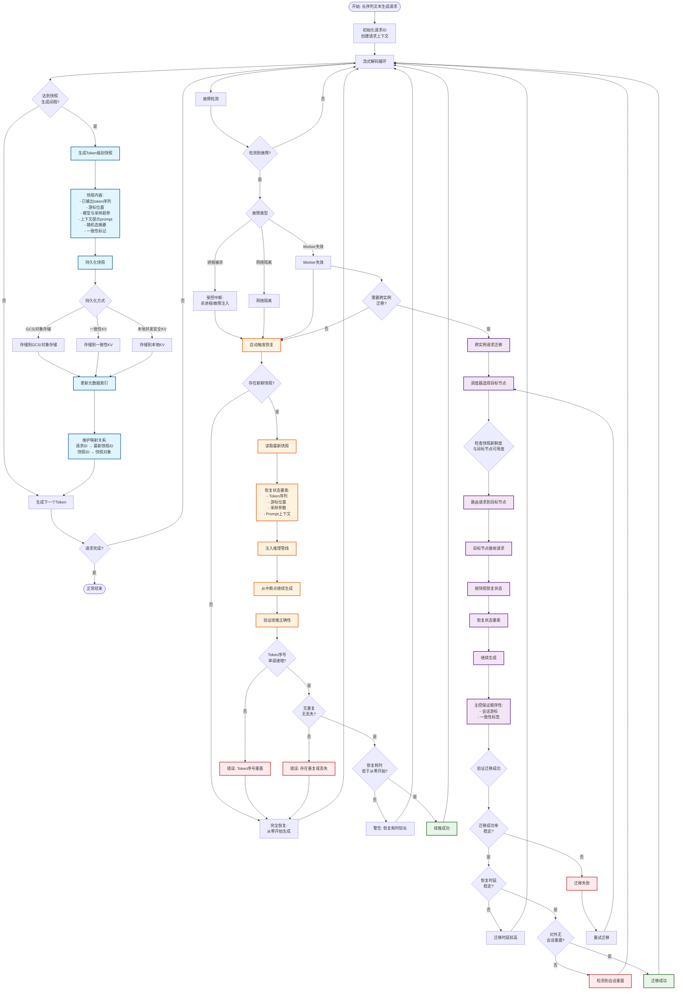
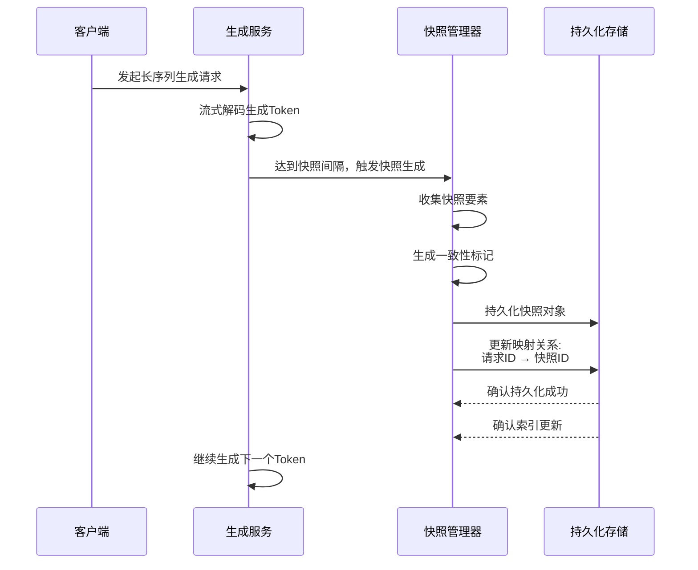
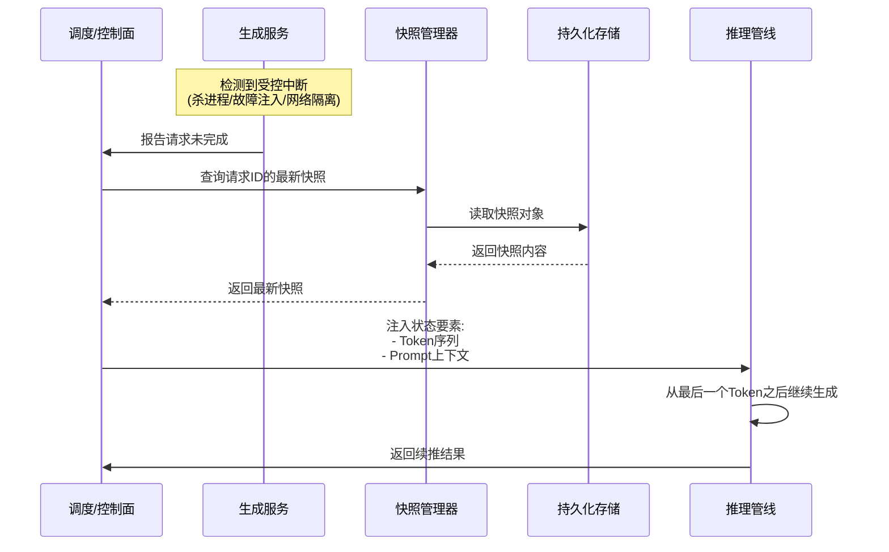
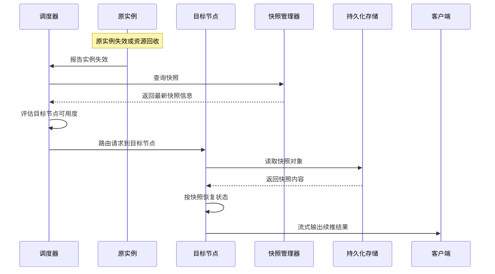

# Token级别续推技术流程图

基于项目代码结构和续推技术实现，以下是完整的续推技术流程图。

## 完整流程图



## 关键流程说明

### 1. Token级别快照生成流程


# End of Selection


### 2. 无客户端参与的断点恢复流程



### 3. 跨实例请求迁移流程



## 核心组件说明

### 快照内容结构
```python
Snapshot = {
    "snapshot_id": str,           # 快照唯一标识
    "request_id": str,             # 请求ID
    "token_sequence": List[int],   # 已输出token序列
    "cursor_position": int,        # 游标位置
    "sampling_params": {           # 采样超参
        "temperature": float,
        "top_k": int,
        "top_p": float,
        "seed": int
    },
    "prompt_context": List[int],   # 上下文提示
    "random_state_hash": str,      # 随机态摘要
    "consistency_markers": {        # 一致性标记
        "timestamp": int,
        "hash": str,
        "etag": str,
        "version": str
    }
}
```

### 元数据索引结构
```python
MetadataIndex = {
    "request_id_to_snapshot_id": {  # 请求ID → 最新快照ID
        "req_001": "snapshot_001",
        "req_002": "snapshot_002"
    },
    "snapshot_id_to_snapshot": {     # 快照ID → 快照对象
        "snapshot_001": Snapshot,
        "snapshot_002": Snapshot
    }
}
```

## 性能指标

### 续推正确性验证
- ✅ Token序号单调递增，不从0重置
- ✅ 无重复Token，无丢失Token
- ✅ 恢复耗时显著低于从零开始生成

### 迁移成功率指标
- ✅ 迁移成功率稳定（>99%）
- ✅ 恢复时延稳定（<100ms）
- ✅ 对外无明显"会话重置"感知

### 快照间隔控制
- 固定间隔：每个Token或每N个Token
- 自适应间隔：基于时延阈值（如每100ms）
- 重算Token比例受快照间隔近似线性控制

## 技术特点

1. **无客户端参与**：恢复过程完全由调度/控制面自动触发
2. **无KV cache依赖**：即使缓存缺失也可用快照完成迁移与续推
3. **一致性保证**：通过会话游标和一致性标签保证顺序性与无重复消费
4. **容错性强**：支持进程被杀、网络隔离、Worker失效等多种故障场景

