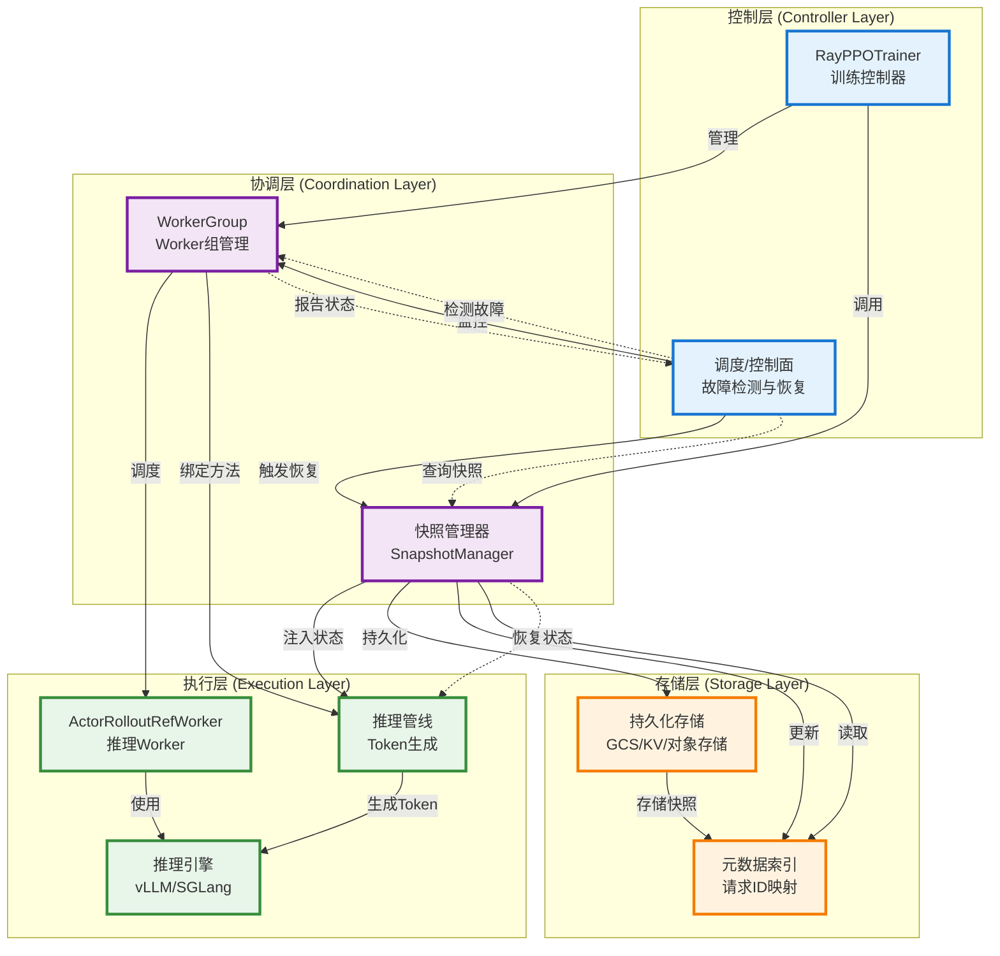
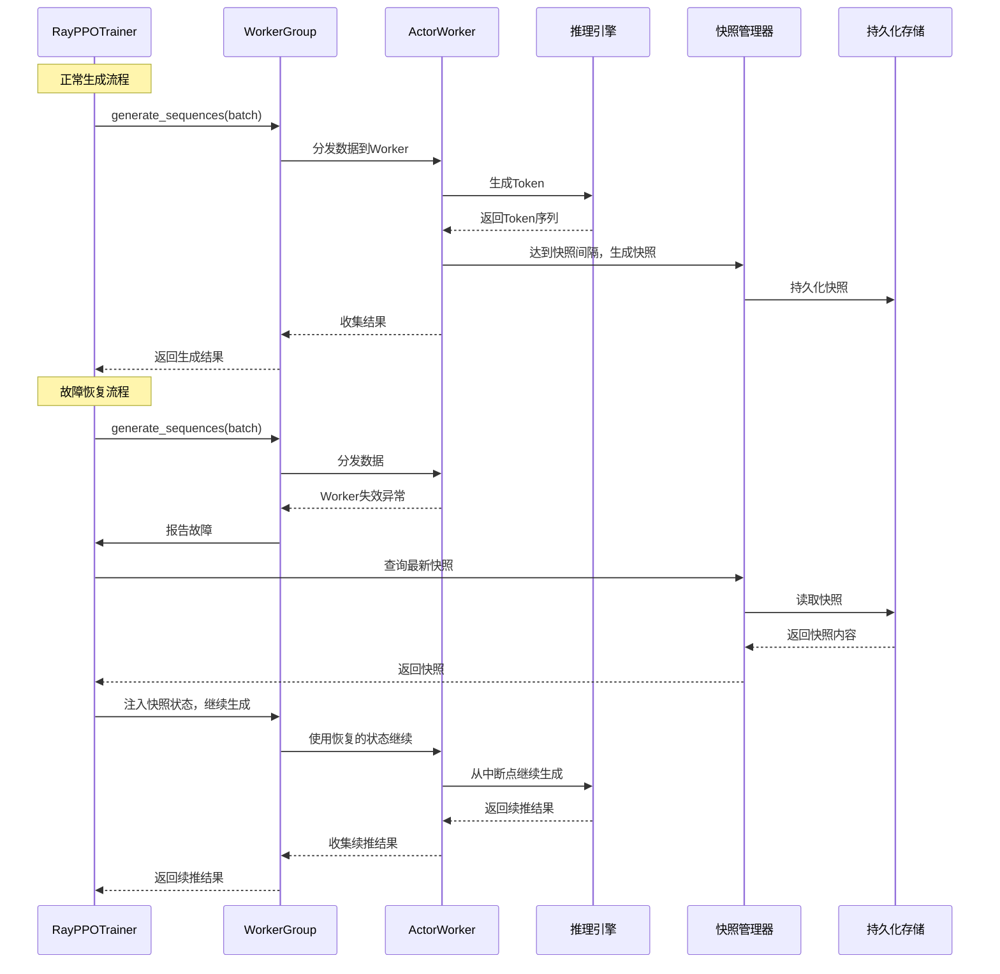

# Token级别续推技术系统架构图

基于verl原架构和续推技术实现，以下是简明的系统架构图。

## 系统架构图



## 架构层次说明

### 第1层：控制层 (Controller Layer)
- **RayPPOTrainer**: 单进程训练控制器，管理整个PPO训练流程
- **调度/控制面**: 负责故障检测、自动恢复触发、跨实例迁移决策

### 第2层：协调层 (Coordination Layer)
- **WorkerGroup**: 管理远程Worker组，提供统一接口进行分布式计算
- **快照管理器**: 负责Token级别快照的生成、持久化、检索和状态恢复

### 第3层：执行层 (Execution Layer)
- **ActorRolloutRefWorker**: 推理Worker，执行模型推理任务
- **推理引擎**: vLLM或SGLang等底层推理框架
- **推理管线**: 实际的Token生成流程，支持续推

### 第4层：存储层 (Storage Layer)
- **持久化存储**: GCS/一致性KV/对象存储，存储快照对象
- **元数据索引**: 维护请求ID到快照ID的映射关系

## 数据流图



## 模块职责说明

### 控制层模块

#### RayPPOTrainer
- **职责**: 单进程训练控制器，管理PPO训练主循环
- **关键功能**:
  - 管理WorkerGroup的创建和生命周期
  - 调用generate_sequences进行推理
  - 处理故障恢复逻辑
  - 协调快照管理器的使用

#### 调度/控制面
- **职责**: 故障检测、恢复决策、跨实例迁移
- **关键功能**:
  - 监控Worker状态
  - 检测故障（进程被杀、网络隔离、Worker失效）
  - 自动触发恢复流程
  - 决策是否需要跨实例迁移

### 协调层模块

#### WorkerGroup
- **职责**: 管理一组远程Worker，提供统一接口
- **关键功能**:
  - 绑定Worker方法（通过@register装饰器）
  - 数据分发（dispatch）和结果收集（collect）
  - Worker存活检测
  - 创建临时WorkerGroup（用于故障恢复）

#### 快照管理器
- **职责**: Token级别快照的完整生命周期管理
- **关键功能**:
  - 生成快照（Token序列、游标位置、采样参数等）
  - 持久化快照到存储层
  - 更新元数据索引
  - 读取快照并恢复状态
  - 注入状态到推理管线

### 执行层模块

#### ActorRolloutRefWorker
- **职责**: 执行模型推理的Worker实例
- **关键功能**:
  - 接收推理请求
  - 调用底层推理引擎
  - 支持Token续推（通过per_request_generated_tokens）
  - 报告生成进度

#### 推理引擎
- **职责**: 底层推理框架（vLLM/SGLang）
- **关键功能**:
  - 执行实际的Token生成
  - 管理KV cache（可选）
  - 支持流式输出

#### 推理管线
- **职责**: Token生成的具体流程
- **关键功能**:
  - 接收快照状态并恢复
  - 从中断点继续生成
  - 保证Token序号连续性

### 存储层模块

#### 持久化存储
- **职责**: 存储快照对象
- **支持方式**:
  - GCS/对象存储
  - 一致性KV存储
  - 本地并发安全KV

#### 元数据索引
- **职责**: 维护请求ID到快照的映射
- **关键功能**:
  - 请求ID → 最新快照ID映射
  - 快照ID → 快照对象映射
  - 支持快速检索

## 关键交互流程

### 1. 正常生成流程
```
Trainer → WorkerGroup → ActorWorker → 推理引擎
                ↓
           快照管理器 → 持久化存储
```

### 2. 故障恢复流程
```
故障检测 → 查询快照 → 恢复状态 → 继续生成
```

### 3. 跨实例迁移流程
```
调度器决策 → 路由到目标节点 → 加载快照 → 恢复状态 → 继续生成
```

## 技术特点

1. **分层清晰**: 4层架构，职责明确
2. **解耦设计**: 控制层与执行层解耦，通过WorkerGroup协调
3. **容错机制**: 多层故障检测和恢复
4. **状态管理**: 快照管理器统一管理状态持久化
5. **可扩展性**: 支持多种推理引擎和存储后端

